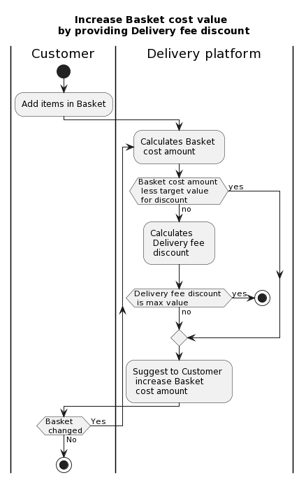

## Table of content
- [Business process](#business-process)
- [User stories and cases](#user-stories-and-cases)
  - [User stories](#user-stories)
    - [DD-1. **As** a customer of the Delivery service, **I want** get delivery fee discount **so that** a my order will be cheaper.](#dd-1-as-a-customer-of-the-delivery-service-i-want-get-delivery-fee-discount-so-that-a-my-order-will-be-cheaper)
    - [DD-2. **As** a manager of the Delivery service, **I want** increase cost of orders **so that** it gets more revenue.](#dd-2-as-a-manager-of-the-delivery-service-i-want-increase-cost-of-orders-so-that-it-gets-more-revenue)
  - [Use cases](#use-cases)
    - [DD-1.1 - A Customer gets the discount after added new items in a basket](#dd-11---a-customer-gets-the-discount-after-added-new-items-in-a-basket)
    - [DD-1.2 - A Customer gets the discount after change quantity exists items in a basket](#dd-12---a-customer-gets-the-discount-after-change-quantity-exists-items-in-a-basket)
    - [DD-2.1 - The Delivery platform suggests the discount](#dd-21---the-delivery-platform-suggests-the-discount)
- [Metrics](#metrics)
  - [Business metrics](#business-metrics)
  - [Technical metrics](#technical-metrics)
- [Functional Requirements](#functional-requirements)
- [Development tasks](#development-tasks)

# Business process

# User stories and cases
## User stories
### DD-1. **As** a customer of the Delivery service, **I want** get delivery fee discount **so that** a my order will be cheaper.  
*Note*: I always want to get most profitable suggestion on a market.

### DD-2. **As** a manager of the Delivery service, **I want** increase cost of orders **so that** it gets more revenue.  
*Note*: I keep track at a business metrics, and the revenue is one of them.

## Use cases
### DD-1.1 - A Customer gets the discount after added new items in a basket
<table>
    <tr>
      <td>Actors</td>
      <td>Customer, Delivery Platform, Mobile App</td>
    </tr>
    <tr>
      <td>Stackholders</td>
      <td>Manager</td>
    </tr>
    <tr>
      <td>Preconditions</td>
      <td>
      <ol>
        <li>
            Manager set target value of basket cost for Delivery fee discount on Delivery platform
        </li>
        <li>
            Manager set values in discount grid on Delivery platform
        </li>
        </ol>
      </td>
    </tr>
    <tr>
      <td>Triggers</td>
      <td>Customer adds item in basket by Mobile App</td>
    </tr>
    <tr>
      <td>Main success scenario</td>
      <td>
        <ol>
            <li>Delivery Platform calculates Basket cost value</li>
            <li>Delivery Platform suggests to Customer adds new items in basket by Mobile App</li>
            <li>Customer adds new items within enough total cost in basket by Mobile App</li>
            <li>Delivery Platform calculates Delivery fee discount</li>
            <li>Customer creates order with Delivery fee discount by Mobile App </li>
        </ol>
      </td>
    </tr>
    <tr>
      <td>Alternative paths</td>
      <td>
      Alt case 1
      <ol start=3>
            <li>Customer ignores a suggest</li>
            <li>Customer creates order without Delivery fee discount by Mobile App </li>
        </ol>
      </td>
    </tr>
  </tbody>
</table>

### DD-1.2 - A Customer gets the discount after change quantity exists items in a basket
<table>
    <tr>
      <td>Actors</td>
      <td>Customer, Delivery Platform, Mobile App</td>
    </tr>
    <tr>
      <td>Stackholders</td>
      <td>Manager</td>
    </tr>
    <tr>
      <td>Preconditions</td>
      <td>
      <ol>
        <li>
            A Manager set a target value of basket cost for the discount on the Delivery platform
        </li>
        <li>
            Manager set values in discount grid on Delivery platform
        </li>
        <li>
        There are quantity of items available for order
        </li>
        </ol>
      </td>
    </tr>
    <tr>
      <td>Triggers</td>
      <td>Customer adds item in basket by Mobile App</td>
    </tr>
    <tr>
      <td>Main success scenario</td>
      <td>
        <ol>
            <li>Delivery Platform calculates Basket cost value</li>
            <li>Delivery Platform suggests to Customer changes quantity of items in basket by Mobile App</li>
            <li>Customer increase quantity of items until enough total cost in basket by Mobile App</li>
            <li>Delivery Platform calculates Delivery fee discount</li>
            <li>Customer creates order with Delivery fee discount by Mobile App </li>
        </ol>
      </td>
    </tr>
    <tr>
      <td>Alternative paths</td>
      <td>
      Alt case 1
      <ol start=3>
            <li>Customer ignores a suggest</li>
            <li>Customer creates order without Delivery fee discount by Mobile App </li>
        </ol>
      Alt case 2
      <ol start=3>
            <li>Customer increase quantity of items in basket by Mobile App, but doesn't rich to enough total cost</li>
            <li>Delivery Platform suggests to Customer changes quantity of items in basket by Mobile App</li>
            <li>Customer ignores a suggest</li>
            <li>Customer creates order without Delivery fee discount by Mobile App </li>
        </ol>
        Alt case 3
      <ol start=3>
            <li>Customer increase quantity of items in basket by Mobile App, but doesn't rich to enough total cost</li>
            <li>Delivery Platform suggests to Customer changes quantity of items in basket by Mobile App</li>
            <li>Customer increase quantity of items until enough total cost in basket by Mobile App</li>
            <li>Customer creates order with Delivery fee discount by Mobile App </li>
        </ol>
      </td>
    </tr>
</table>

### DD-2.1 - The Delivery platform suggests the discount
<table>
    <tr>
      <td>Actors</td>
      <td>Manager, Delivery Platform</td>
    </tr>
    <tr>
      <td>Stackholders</td>
      <td>Customer</td>
    </tr>
    <tr>
      <td>Preconditions</td>
      <td>
      <ol>
        <li>
            A Manager set a target value of basket cost for the discount on the Delivery platform
        </li>
        <li>
            A Manager set a target revenue metric on the Delivery platform
        </li>
      </td>
    </tr>
    <tr>
      <td>Triggers</td>
      <td>A forecast of the revenue metric doesn't rich target value</td>
    </tr>
    <tr>
      <td>Main success scenario</td>
      <td>
        <ol>
            <li>Manager checks sign of revenue metric on Delivery Platform</li>
            <li>Manager activates discount program on Delivery Platform - Delivery fee discount from definition amount</li>
            <li>Delivery Platform suggests to groups of Customer Delivery fee discount from definition amount</li>
            <li>Delivery Platform periodical checks the revenue metric</li>
            <li>Delivery Platform gives sign of the change revenue metric</li>
            <li>Manager checks sign of revenue metric on Delivery Platform</li>
            <li>Manager deactivates a discount program on the Delivery Platform - Delivery fee discount from definition amount. If forecast of revenue metric has riched target value.</li>
        </ol>
      </td>
    </tr>
    <tr>
      <td>Alternative paths</td>
      <td>
      Alt case 1
      <ol start=7>
            <li>Manager leaves without changes launched discount program on the Delivery Platform - Delivery fee discount from definition amount. If forecast of revenue metric hasn't reached target value.</li>
        </ol>
        Alt case 2
      <ol start=2>
            <li>Delivery Platform automatically activates discount program - Delivery fee discount from definition amount</li>
            <li>Delivery Platform suggests to groups of Customer Delivery fee discount from definition amount</li>
            <li>Delivery Platform periodical checks the revenue metric</li>
            <li>Delivery Platform deactivates a discount program - Delivery fee discount from definition amount. If forecast of revenue metric has riched target value.</li>
        </ol>
      </td>
    </tr>
  </tbody>
</table>

# Metrics
## Business metrics
1. ARPDAU (average revenue per daily active user). This value shows dynamic changes revenue before/after suggest of the discount.
2. DAU which accepted the suggest. This value shows interest of a Customer to the discount.
3. Forecast ARPMAU (average revenue per monthly active user). Accept decision about suggest the discount depends from changes of this value.
## Technical metrics
1. Count of attempts when quantity of items didn't available.
2. Count of attempts when a Customer's favorite item didn't available.
3. Count of attempts when a Customer was continuing to make order with minimal the discount.
4. DAU per Use case which accepted the suggest.

# Functional Requirements
**Use case**: *DD-1.1 - A Customer gets the discount after added new items in a basket*

<table>
    <tr>
      <th>Code</th>
      <th>Name</th>
      <th>Description</th>
    </tr>
    <tr>
      <td>DD-1.1-1</td>
      <td>Settings for the discount</td>
      <td>User with Manager role must gets opportunity set up Target value of basket cost for Delivery fee discount, discount grid on Delivery Platform. Discount grid contains from values the settings above which correlates each other - if basket cost more then discount more. Max value of Delivery fee discount = 100%</td>
    </tr>
    <tr>
      <td>DD-1.1-2</td>
      <td>Consider the discount settings in algorithm of calculate basket cost value</td>
      <td>Delivery Platform must considers the discount settings (DD-1.1-1) in algorithm of calculate basket cost value. New algorithm TBD</td>
    </tr>
    <tr>
      <td>DD-1.1-3</td>
      <td>Suggestion discount for Customer</td>
      <td>Delivery Platform makes suggestion of Delivery fee discount to Customer by Mobile App. Suggestion appears per each Customer's order which reached Target basket cost for discount. Delivery Platform recalculate discount after each change of basket cost</td>
    </tr>
    <tr>
      <td>DD-1.1-4</td>
      <td>Dashboard for metrics of feature</td>
      <td>Reporting services should has a dashboard with business and technical metrics of feature. Metrics was describe in separate file "Metrics"</td>
    </tr>
</table>

# Development tasks
