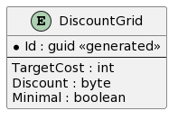

# Development tasks

## Task 1 - [backend] Delivery platform. Add settings for discount
_Description:_  
    1. Create new table Discount grid.  
     
    2. Change algorithm of calculate basket cost value - include in the formula new variable for Delivery fee discount which is subtracted from the cost total. The variable takes a value within depends from include the cost total between neighbours value of discount grid. Max value for "Discount" field = 100.  
    3. Add new attributes in response GET /app/v1/calculate to Mobile App: "extra_sum_disc":int.  
   *Formula if CalcCost greater than Minimal Target Cost in the grid*: _extra_sum_disc = min(TargetCost) - CalcCost_  
    *Formula if CalcCost between two values Target Cost in the grid*: _extra_sum_disc = max(TargetCost) - CalcCost_  
    
_Links:_  
    1. UserStory  
    2. Use case  
    3. REQ  

## Task 2 - [frontend] Mobile App. Add pop-up for discount
_Description:_  
    1. If there is attribute "extra_sum_disc" in response GET /app/v1/calculate by Delivery platform the Mobile App shows Customer suggest pop-up with this additional amount diff.  
    2. Show extra items on the main screen and on the screen of basket. Extra items must be able to available for order.
   UI/UX mockups attached by link.

_Links:_  
    1. UserStory  
    2. Use case  
    3. Figma mockup  

## Task 3 - [backend] Reporting services. Add dashboard
_Description:_  
    1. Create Dashboard at table view include all metrics of new feature - Delivery fee discount.  
    2. Create Dashboard at bar chart with comparison plan/fact for ARPDAU.

_Links:_  
    1. UserStory  
    2. Use case  
    3. REQ - DD-1.1-4